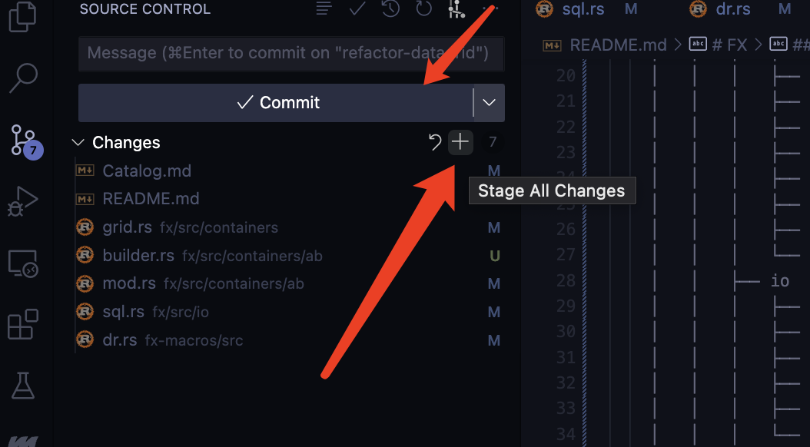
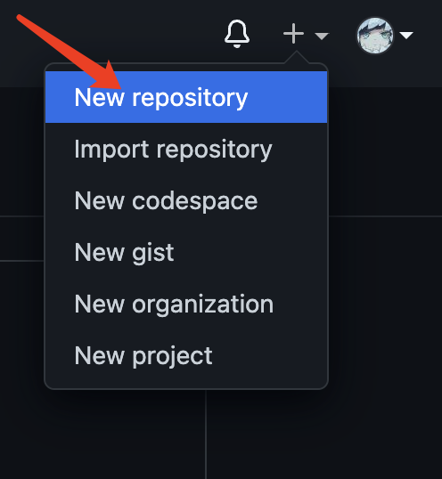

# Git Tutorial

## 简介

Git 是什么？Git 是一个开源的版本控制系统。

Git 的安装：<http://git-scm.com/downloads>

Vs Code 上 Git 的插件：Git History/Git Graph，侧边栏的插件处即可进行搜索以及安装

## Git 的基本配置

- `git config --list` 显示当前的 git 配置信息

- `git config --global user.name "<your name>"` 配置你的 Git 名称，用于提交代码时显示的用户信息

- `git config --global user.email <your email>` 配置你的 Git 邮箱，用于提交代码时显示的用户信息

### 针对 GitHub 的额外设置（免密登录）

1. `ssh-keygen -t rsa` 生成 SSH 密钥

1. `cat ~/.ssh/id_rsa.pub` 拷贝公钥至 GitHub 的[用户设置界面](https://github.com/settings/keys)

## Git 的工作模式

- 工作区：本地所见的目录

- 暂存区：工作区的文件新增或者修改会被记录在此（不需要特别的关心，因为 Vs Code 的插件已经为我们做了，并且提供了界面） --- 待展示

- 版本库：使用 `git commit` 提交时，所有文件的修改会被归档至此（后续的 `git push`，即将本地版本提交到远程仓库，就是从这里提交）

## Git 的基本命令

### 项目下载与同步

- `git clone <repo>` 或者 `git clone <repo> <directory>` 从 Git 仓库中拷贝项目至本地

- `git pull` 从 Git 仓库中拉取最新的版本至本地

### 项目编辑

- :star: `git init` 用于初始化一个 Git 仓库

  

- `git add *.py` 添加所有以 py 为后缀的文件进入版本控制

- `git rm <file>` 将文件从暂存区移除

- `git mv <file> <newfile>` 移动或重命名一个文件

- `git reset` 回退版本

- :star: `git commit -m '初始版本'` 归档当次所有修改内容

  

- `git reset --soft HEAD^` 撤回本次提交的内容（--soft 表示不删除工作空间代码；--hard 表示删除工作空间代码；HEAD^ 表示回到上一个版本（在 push 之前你可能有多次 commit），也可以写成 DEAD~1）**该命令比较危险，慎用！**

  

- `git status` 查看仓库当前状态，显示变更文件

- `git diff` 比较暂存区与工作区的差异

### 项目提交

- :star: `git push` 上传代码至远程仓库

  

### 历史查看

- :star: `git log` 回顾提交历史

  

- :star: `git blame <file>` 查看指定文件的修改记录

  

  

### 分支管理

- :star: `git branch <branch_name>` 创建分支

  

- `git checkout <branch_name>` 切换分支

- `git merge` 分支合并

### 其他

- 关于 `.gitignore` 文件，其用于屏蔽特定格式下的文件

  

## GitHub 的基本用法

- 创建新的 Repository

  

- 区分私有/公有项目

  

## 引用

- [Git 官网](https://git-scm.com/)

- [Git 菜鸟教程](https://www.runoob.com/git/git-tutorial.html)
