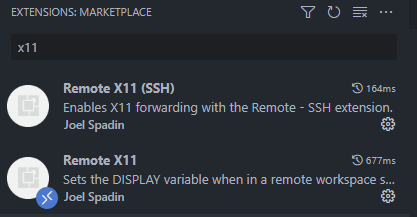
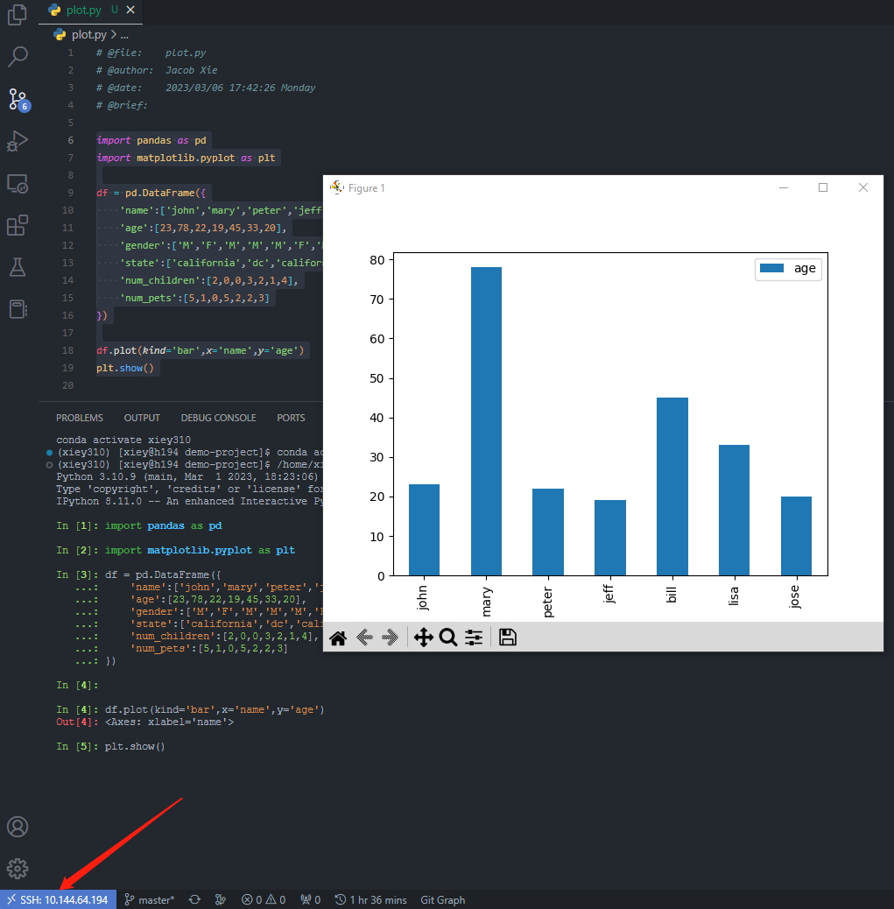

# 远程连接下的 Vs Code 作图

## 下载 Windows 所需的软件

[下载地址](\\10.144.64.136\factor\users\public\soft\vcxsrv-64.1.20.8.1.installer.exe)

安装完成后请保持后台持续开启，如果无法开启请检查是否存在端口冲突（或者直接重启 Windows）。

## Vs Code 插件下载

侧边栏插件处搜索 x11：

## 测试

使用 [plot.py](./plot.py) 测试，可以看到在远程 Vs Code 的情况下，图片在 Windows 上展示：

