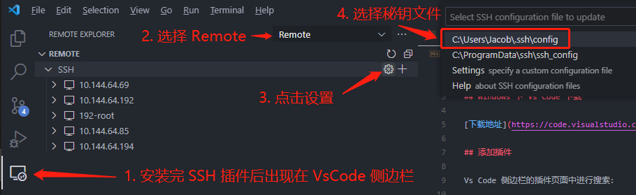
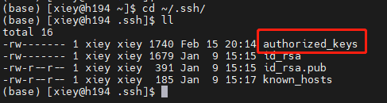
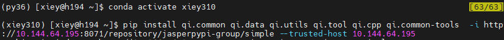
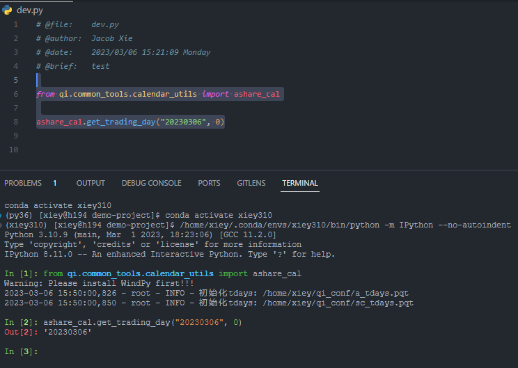

# Vs Code 与 Python 环境

## Windows 下 Vs Code 下载

[下载地址](https://code.visualstudio.com/download)

## 添加插件

Vs Code 侧边栏的插件页面中进行搜索：


- Python：Py 插件

- Pylance：Py 语言支持


- Remote - SSH：用于远程连接服务器

## 设置 SSH 远程连接

1. 打开 Windows 的 Terminal 或者 Powershell，输入 `ssh-keygen` 后一直回车（已有的情况下选 `n`）：

    

1. 添加 SSH 文件至 Vs Code 中：

    

1. 配置文件如下，其中 Host 用于区分不同服务器（可修改），HostName 代表 IP 地址，User 代表远程服务器中的用户名，而 IdentityFile 则是刚刚用 `ssh-keygen` 命令生成的文件地址：

    

1. 设置完毕后选择 SSH 插件的刷新后，即可进行连接（注意如果没有设置免密时，每次登录都需要输入密码）

    

## 可选：SSH 远程连接免密

1. 免密设置第一步，在 Windows 的 Terminal 或 Powershell 中输入 `cat C:\Users\Jacob/.ssh/id_rsa.pub`（具体位置为用户秘钥的生成位置），复制出现的所有字符串：

    

1. 打开远程服务器的 Terminal，执行 `cd ~/.ssh/` 进入 SSH 文件路径下，确认 `authorized_keys` 文件是否存在，如果不存在则新建一个：

    

1. 将从 Windows 复制的公钥字符串，黏贴进 `authorized_keys` 文件中，注意不要修改其它人的公钥字符串：

    

## 在远程服务器中创建 Python 环境

1. 使用 Conda 创建新的 Python 环境，例如：`conda create -n xiey310 python=3.10`：

    

1. 进入新的 Python 环境中安装 Qi 工具，输入 `pip install qi.common qi.data qi.utils qi.tool qi.cpp qi.common-tools -i http://10.144.64.195:8071/repository/jasperpypi-group/simple --trusted-host 10.144.64.195`：

    

1. 环境安装好后，使用 Vs Code 远程进入到服务器，打开任意 Python 文件后可以在 Vs Code 右下角选择 Python 解释器：

    

## Vs Code 中 Python 的运行与调试

1. 打开 Vs Code 的工具栏 (Ctrl + Shift + P)，输入 `Open User Settings (JSON)`：

    

1. 将以下内容复制进文件并保存

    ```txt
    "python.terminal.launchArgs": [
      "-m",
      "IPython",
      "--no-autoindent"
    ],
    ```

    

1. 打开 Vs Code 的快捷键设置，输入 `Python: Run Selection/Line in Python Terminal`，设置一个快捷键

    

1. 选中代码后，使用刚刚设置的快捷键即可进入 Python 交互环境：

    
